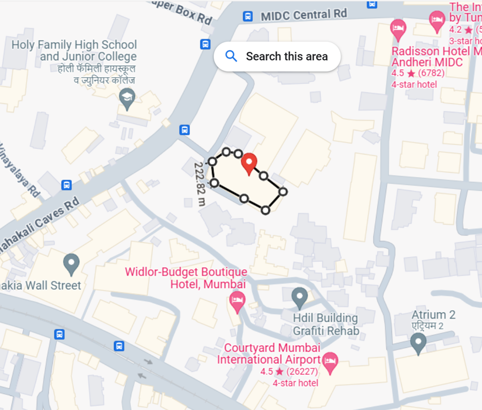

# Data Center Design

## Project Overview
The Data Center Design project focuses on creating an efficient and secure data center for a car sales company. The design aims to support critical applications, manage IT infrastructure, and ensure reliable data storage and retrieval.

## Table of Contents
- [Introduction](#introduction)
- [Objectives](#objectives)
- [Requirements](#requirements)
- [Location](#location)
- [Risk Assessment](#risk-assessment)
- [Prototype](#prototype)
- [Services Implemented](#services-implemented)
- [Installation](#installation)
- [Usage](#usage)
- [Contributing](#contributing)
- [License](#license)

## Introduction
This project outlines the design of a data center that supports an internal ERP application and a third-party DMS application, along with a database and email server. It emphasizes security, accessibility, and efficient management of IT resources.

## Objectives
- Construct a data center to manage IT infrastructure efficiently and securely.
- Host critical applications and ensure reliable data services.

## Requirements
The data center must support:
- Internal ERP application
- Third-party DMS application
- Database server
- Email services with POP and IMAP
- Segmented VLANs for customers and auditors

## Location
The data center is located within the organization's headquarters in Mumbai, ensuring quick access for maintenance and security.

## Risk Assessment
Key risks include physical threats (fire, flooding), technical vulnerabilities (hardware failure, cyber-attacks), and operational challenges (power outages, human errors). Mitigation strategies are outlined in the project documentation.

## Prototype
The prototype includes:
- Web servers for ERP and DMS applications
- Windows Server 2022 for critical services
- Environmental controls for optimal conditions

## Services Implemented
- **Windows Server 1**: Active Directory, DNS, DHCP
- **Windows Server 2**: ERP application, DMS application
- **Windows Server 3**: Email services

## Installation
Instructions on setting up the data center prototype can be found in the respective documentation files.

## Usage
Details on how to utilize the data center services will be provided in the documentation.

## Contributing
Contributions are welcome! Please submit a pull request or open an issue for any suggestions or improvements.

## License
This project is licensed under the MIT License. See the [LICENSE](LICENSE) file for more information.
